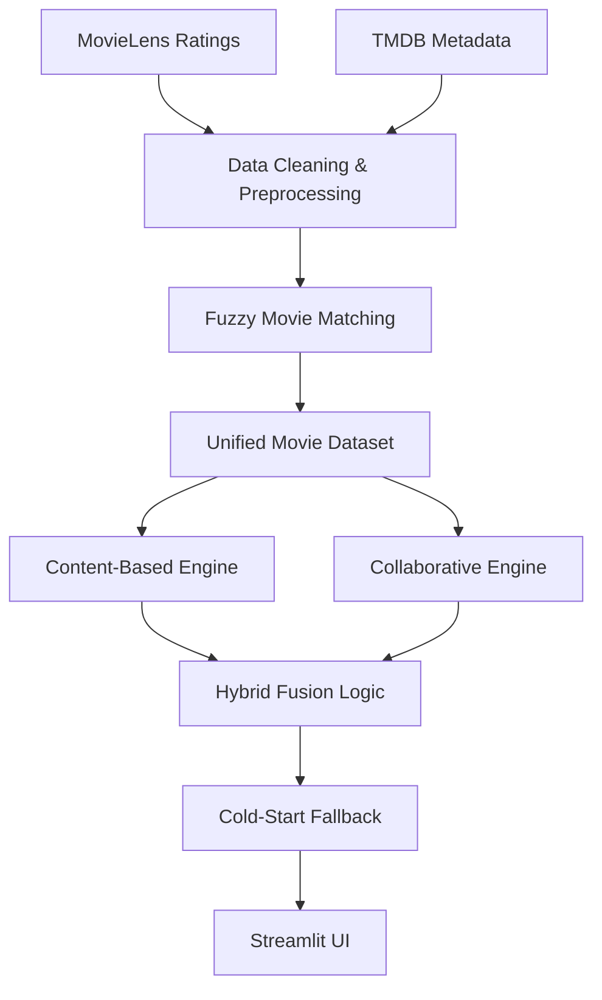

# 🎬 **Velora Movie Recommender**

Velora is a **hybrid movie recommendation engine** that intelligently combines **Content-Based Filtering**, **Collaborative Filtering**, and **Cold-Start strategies** to deliver personalized movie recommendations.

The system is designed to mirror how **real-world recommender systems** work in platforms like Netflix and Amazon Prime — balancing **user behavior**, **movie metadata**, and **fallback logic** when data is sparse.

---

## 🚀 **Key Highlights**

* ✅ **Hybrid Recommendation Engine** (Content + Collaborative + Cold Start)
* ✅ **Real-world datasets** (MovieLens + TMDB metadata)
* ✅ **Fuzzy entity resolution** between different data sources
* ✅ **Evaluation metrics** (Precision@K, Hit Rate)
* ✅ **Modular, scalable architecture**
* ✅ **Streamlit-based interactive UI**

---

## 🧠 **Recommendation Strategies Implemented**

### 1️⃣ Content-Based Filtering

* Uses **movie metadata** (overview, genres)
* Applies **TF-IDF Vectorization**
* Computes similarity using **Cosine Similarity**
* Recommends movies **similar to a selected seed movie**

📌 Best for:

* New users
* Movie-centric discovery

---

### 2️⃣ Collaborative Filtering

* Uses **MovieLens user ratings**
* Builds a **User–Item Interaction Matrix**
* Computes **item-item similarity**
* Recommends movies based on **collective user behavior**

📌 Best for:

* Users with historical data
* Capturing crowd preferences

---

### 3️⃣ Cold-Start Strategy

* Activated when:

  * User has no history
  * Mapping is unavailable
* Recommends **popular & highly rated movies**
* Prevents empty recommendation states

📌 Solves the **Cold Start Problem**

---

## 🏗️ **System Architecture**



---

## 🔄 **End-to-End Workflow**

1. **Data Loading**

   * MovieLens ratings & movies
   * TMDB metadata

2. **Entity Resolution**

   * Fuzzy string matching aligns MovieLens movies with TMDB IDs

3. **Feature Engineering**

   * TF-IDF vectors for content similarity
   * User-item matrix for collaborative filtering

4. **Recommendation Inference**

   * Strategy selected (Content / Collaborative / Hybrid)
   * Scores computed and ranked

5. **Evaluation**

   * Precision@K
   * Hit Rate (for users with history)

6. **Presentation**

   * Results displayed in Streamlit UI with posters

---

## 📊 **Evaluation Metrics**

| Metric          | Description                                                 |
| --------------- | ----------------------------------------------------------- |
| **Precision@K** | Fraction of recommended movies that the user actually liked |
| **Hit Rate**    | Whether at least one relevant movie was recommended         |

These metrics ensure the system is **measurable and interview-ready**.

---

## 🛠️ **Tech Stack**

### Core ML & Data

* **Python**
* **Pandas**, **NumPy**
* **Scikit-Learn**
* **TF-IDF Vectorizer**
* **Cosine Similarity**

### Data Engineering

* **MovieLens Dataset**
* **TMDB Dataset**
* **Fuzzy Matching (Difflib)**

### Application Layer

* **Streamlit**
* **Custom CSS / Base64 backgrounds**
* **TMDB Poster Integration**

---

## 📂 **Project Structure**

```
velora-movie-recommender/
│
├── data/
│   ├── tmdb_5000_movies.csv
│   ├── movielens_movies.csv
│   ├── movielens_ratings.csv
│
├── recommender/
│   ├── content_based.py
│   ├── collaborative.py
│   ├── cold_start.py
│   ├── hybrid_engine.py
│   ├── evaluation.py
│   └── utils.py
│
├── app.py
├── requirements.txt
└── README.md
```

---

## 🧩 **Design Principles**

* **Separation of concerns**
* **Fail-safe fallbacks**
* **Extensible hybrid logic**
* **Production-like data flow**

This structure makes the system easy to:

* Extend with **SVD / Matrix Factorization**
* Replace similarity metrics
* Add **Neural Collaborative Filtering**

---

## 🚧 **Future Improvements**

* 🔹 Matrix Factorization (SVD)
* 🔹 Neural Collaborative Filtering
* 🔹 Learning-to-Rank layer
* 🔹 Online user feedback loop
* 🔹 Deployment on cloud (AWS / GCP)

---

## 🎯 **Why This Project Matters**

Velora demonstrates:

* Practical understanding of **recommendation systems**
* Real-world data challenges (ID mismatch, sparsity)
* Strong **ML + Data Engineering fundamentals**
* Ability to build **end-to-end systems**, not just notebooks

---

⭐ *If you like this project, give it a star — it helps a lot!*
